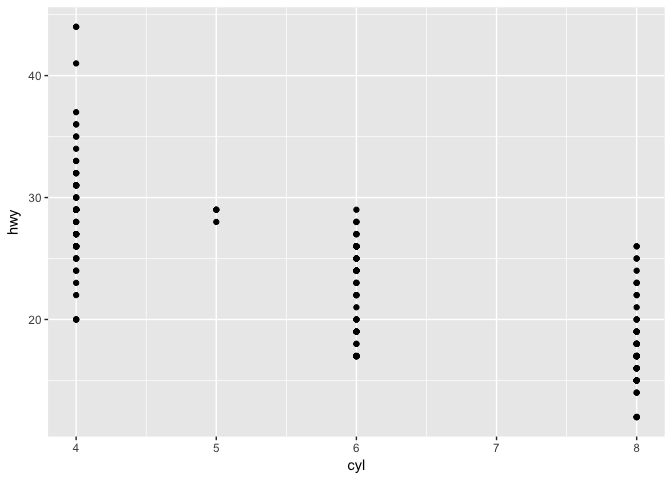
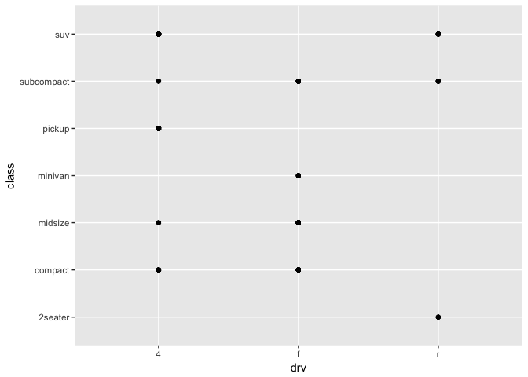

Chapter 1 - Data Visualization with ggplot2
================
2018-01-16

<!-- ```{r setup, include=FALSE} -->
<!-- knitr::opts_chunk$set(echo = TRUE) -->
<!-- ``` -->
Introduction
============

> “The simple graph has brought more information to the data analyst’s mind than any other device.” — John Tukey

Data visualisation
==================

Introduction
------------

> "The simple graph has brought more information to the data analyst’s mind than any other device." --- John Tukey

This chapter will teach you how to visualise your data using ggplot2. R has several systems for making graphs, but ggplot2 is one of the most elegant and most versatile. ggplot2 implements the **grammar of graphics**, a coherent system for describing and building graphs. With ggplot2, you can do more faster by learning one system and applying it in many places.

If you'd like to learn more about the theoretical underpinnings of ggplot2 before you start, I'd recommend reading "The Layered Grammar of Graphics", <http://vita.had.co.nz/papers/layered-grammar.pdf>.

### Prerequisites

This chapter focusses on ggplot2, one of the core members of the tidyverse. To access the datasets, help pages, and functions that we will use in this chapter, load the tidyverse by running this code:

``` r
library(tidyverse)
```

    ## ── Attaching packages ───────────────────────────────────────────────────────────────────── tidyverse 1.2.1 ──

    ## ✔ ggplot2 2.2.1     ✔ purrr   0.2.4
    ## ✔ tibble  1.3.4     ✔ dplyr   0.7.4
    ## ✔ tidyr   0.7.2     ✔ stringr 1.2.0
    ## ✔ readr   1.1.1     ✔ forcats 0.2.0

    ## ── Conflicts ──────────────────────────────────────────────────────────────────────── tidyverse_conflicts() ──
    ## ✖ dplyr::filter() masks stats::filter()
    ## ✖ dplyr::lag()    masks stats::lag()

That one line of code loads the core tidyverse; packages which you will use in almost every data analysis. It also tells you which functions from the tidyverse conflict with functions in base R (or from other packages you might have loaded).

If you run this code and get the error message "there is no package called ‘tidyverse’", you'll need to first install it, then run `library()` once again.

``` r
install.packages("tidyverse")
library(tidyverse)
```

You only need to install a package once, but you need to reload it every time you start a new session.

If we need to be explicit about where a function (or dataset) comes from, we'll use the special form `package::function()`. For example, `ggplot2::ggplot()` tells you explicitly that we're using the `ggplot()` function from the ggplot2 package.

First steps
-----------

Let's use our first graph to answer a question: Do cars with big engines use more fuel than cars with small engines? You probably already have an answer, but try to make your answer precise. What does the relationship between engine size and fuel efficiency look like? Is it positive? Negative? Linear? Nonlinear?

### The `mpg` data frame

You can test your answer with the `mpg` **data frame** found in ggplot2 (aka `ggplot2::mpg`). A data frame is a rectangular collection of variables (in the columns) and observations (in the rows). `mpg` contains observations collected by the US Environment Protection Agency on 38 models of car.

``` r
mpg
```

    ## # A tibble: 234 x 11
    ##    manufacturer      model displ  year   cyl      trans   drv   cty   hwy
    ##           <chr>      <chr> <dbl> <int> <int>      <chr> <chr> <int> <int>
    ##  1         audi         a4   1.8  1999     4   auto(l5)     f    18    29
    ##  2         audi         a4   1.8  1999     4 manual(m5)     f    21    29
    ##  3         audi         a4   2.0  2008     4 manual(m6)     f    20    31
    ##  4         audi         a4   2.0  2008     4   auto(av)     f    21    30
    ##  5         audi         a4   2.8  1999     6   auto(l5)     f    16    26
    ##  6         audi         a4   2.8  1999     6 manual(m5)     f    18    26
    ##  7         audi         a4   3.1  2008     6   auto(av)     f    18    27
    ##  8         audi a4 quattro   1.8  1999     4 manual(m5)     4    18    26
    ##  9         audi a4 quattro   1.8  1999     4   auto(l5)     4    16    25
    ## 10         audi a4 quattro   2.0  2008     4 manual(m6)     4    20    28
    ## # ... with 224 more rows, and 2 more variables: fl <chr>, class <chr>

Among the variables in `mpg` are:

1.  `displ`, a car's engine size, in litres.

2.  `hwy`, a car's fuel efficiency on the highway, in miles per gallon (mpg). A car with a low fuel efficiency consumes more fuel than a car with a high fuel efficiency when they travel the same distance.

To learn more about `mpg`, open its help page by running `?mpg`.

### Creating a ggplot

To plot `mpg`, run this code to put `displ` on the x-axis and `hwy` on the y-axis:

``` r
ggplot(data = mpg) + 
  geom_point(mapping = aes(x = displ, y = hwy))
```


The plot shows a negative relationship between engine size (`displ`) and fuel efficiency (`hwy`). In other words, cars with big engines use more fuel. Does this confirm or refute your hypothesis about fuel efficiency and engine size?

With ggplot2, you begin a plot with the function `ggplot()`. `ggplot()` creates a coordinate system that you can add layers to. The first argument of `ggplot()` is the dataset to use in the graph. So `ggplot(data = mpg)` creates an empty graph, but it's not very interesting so I'm not going to show it here.

You complete your graph by adding one or more layers to `ggplot()`. The function `geom_point()` adds a layer of points to your plot, which creates a scatterplot. ggplot2 comes with many geom functions that each add a different type of layer to a plot. You'll learn a whole bunch of them throughout this chapter.

Each geom function in ggplot2 takes a `mapping` argument. This defines how variables in your dataset are mapped to visual properties. The `mapping` argument is always paired with `aes()`, and the `x` and `y` arguments of `aes()` specify which variables to map to the x and y axes. ggplot2 looks for the mapped variable in the `data` argument, in this case, `mpg`.

### A graphing template

Let's turn this code into a reusable template for making graphs with ggplot2. To make a graph, replace the bracketed sections in the code below with a dataset, a geom function, or a collection of mappings.

``` r
ggplot(data = <DATA>) + 
  <GEOM_FUNCTION>(mapping = aes(<MAPPINGS>))
```

The rest of this chapter will show you how to complete and extend this template to make different types of graphs. We will begin with the `<MAPPINGS>` component.

### Exercises

1.  Run `ggplot(data = mpg)`. What do you see?

``` r
ggplot(data = mpg) #An empty graph / a gray box / an empty coordinate system
```

1.  How many rows are in `mpg`? How many columns?

``` r
dim(mpg)
```

    ## [1] 234  11

1.  What does the `drv` variable describe? Read the help for `?mpg` to find out.

``` r
?mpg
```

drv f = front-wheel drive, r = rear wheel drive, 4 = 4wd

1.  Make a scatterplot of `hwy` vs `cyl`.

``` r
ggplot(mpg) +
  geom_point(aes(cyl, hwy))
```



1.  What happens if you make a scatterplot of `class` vs `drv`? Why is the plot not useful?

``` r
ggplot(mpg) +
  geom_point(aes(drv, class)) # Informs of existence, nothing more.
```


