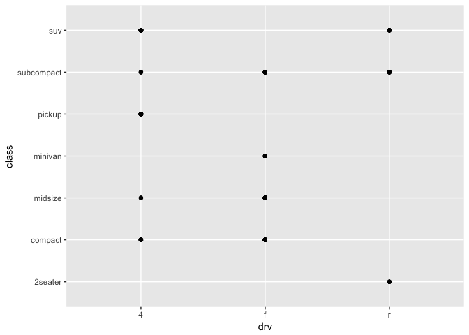
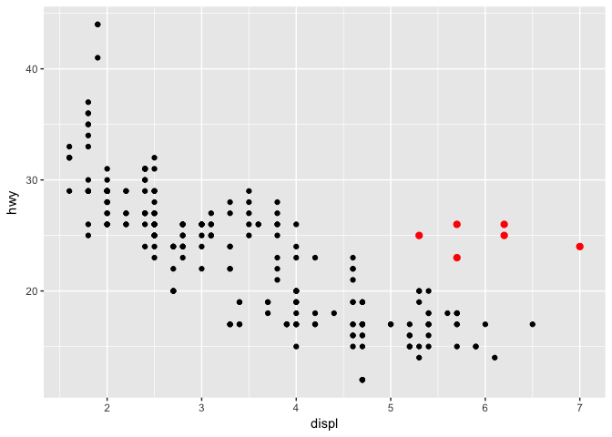
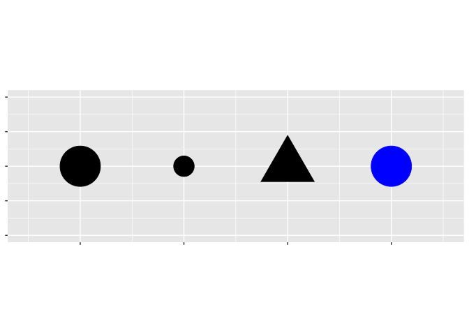
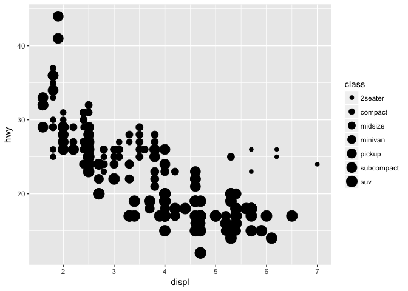
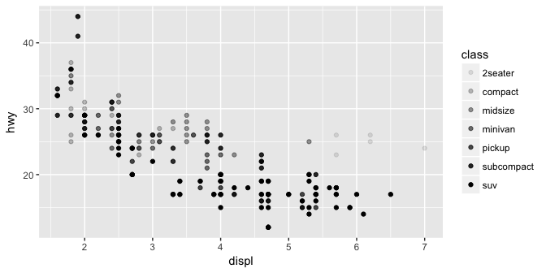
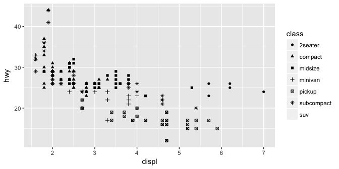
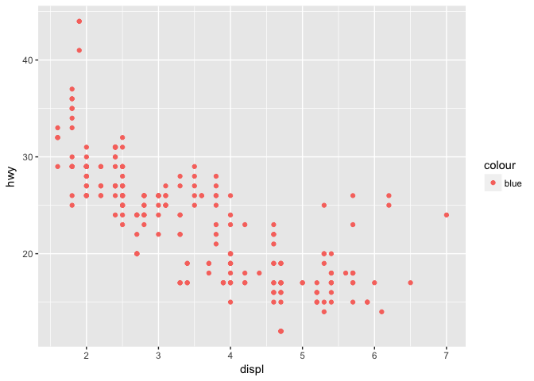
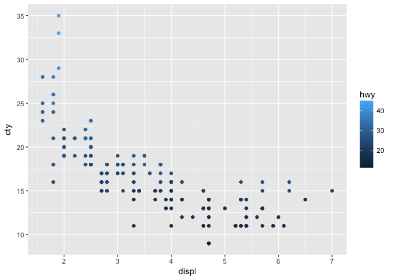

Chapter 1 - Data Visualization with ggplot2
================
2018-01-16

<!-- ```{r setup, include=FALSE} -->
<!-- knitr::opts_chunk$set(echo = TRUE) -->
<!-- ``` -->
Introduction
============

> “The simple graph has brought more information to the data analyst’s mind than any other device.” — John Tukey

Data visualisation
==================

Introduction
------------

> "The simple graph has brought more information to the data analyst’s mind than any other device." --- John Tukey

This chapter will teach you how to visualise your data using ggplot2. R has several systems for making graphs, but ggplot2 is one of the most elegant and most versatile. ggplot2 implements the **grammar of graphics**, a coherent system for describing and building graphs. With ggplot2, you can do more faster by learning one system and applying it in many places.

If you'd like to learn more about the theoretical underpinnings of ggplot2 before you start, I'd recommend reading "The Layered Grammar of Graphics", <http://vita.had.co.nz/papers/layered-grammar.pdf>.

### Prerequisites

This chapter focusses on ggplot2, one of the core members of the tidyverse. To access the datasets, help pages, and functions that we will use in this chapter, load the tidyverse by running this code:

``` r
library(tidyverse)
```

    ## ── Attaching packages ──────────────────────────────────────────────────────────────────────────────────────────────────────────────────────────────────────────────── tidyverse 1.2.1 ──

    ## ✔ ggplot2 2.2.1     ✔ purrr   0.2.4
    ## ✔ tibble  1.3.4     ✔ dplyr   0.7.4
    ## ✔ tidyr   0.7.2     ✔ stringr 1.2.0
    ## ✔ readr   1.1.1     ✔ forcats 0.2.0

    ## ── Conflicts ─────────────────────────────────────────────────────────────────────────────────────────────────────────────────────────────────────────────────── tidyverse_conflicts() ──
    ## ✖ dplyr::filter() masks stats::filter()
    ## ✖ dplyr::lag()    masks stats::lag()

That one line of code loads the core tidyverse; packages which you will use in almost every data analysis. It also tells you which functions from the tidyverse conflict with functions in base R (or from other packages you might have loaded).

If you run this code and get the error message "there is no package called ‘tidyverse’", you'll need to first install it, then run `library()` once again.

``` r
install.packages("tidyverse")
library(tidyverse)
```

You only need to install a package once, but you need to reload it every time you start a new session.

If we need to be explicit about where a function (or dataset) comes from, we'll use the special form `package::function()`. For example, `ggplot2::ggplot()` tells you explicitly that we're using the `ggplot()` function from the ggplot2 package.

First steps
-----------

Let's use our first graph to answer a question: Do cars with big engines use more fuel than cars with small engines? You probably already have an answer, but try to make your answer precise. What does the relationship between engine size and fuel efficiency look like? Is it positive? Negative? Linear? Nonlinear?

### The `mpg` data frame

You can test your answer with the `mpg` **data frame** found in ggplot2 (aka `ggplot2::mpg`). A data frame is a rectangular collection of variables (in the columns) and observations (in the rows). `mpg` contains observations collected by the US Environment Protection Agency on 38 models of car.

``` r
mpg
```

    ## # A tibble: 234 x 11
    ##    manufacturer      model displ  year   cyl      trans   drv   cty   hwy
    ##           <chr>      <chr> <dbl> <int> <int>      <chr> <chr> <int> <int>
    ##  1         audi         a4   1.8  1999     4   auto(l5)     f    18    29
    ##  2         audi         a4   1.8  1999     4 manual(m5)     f    21    29
    ##  3         audi         a4   2.0  2008     4 manual(m6)     f    20    31
    ##  4         audi         a4   2.0  2008     4   auto(av)     f    21    30
    ##  5         audi         a4   2.8  1999     6   auto(l5)     f    16    26
    ##  6         audi         a4   2.8  1999     6 manual(m5)     f    18    26
    ##  7         audi         a4   3.1  2008     6   auto(av)     f    18    27
    ##  8         audi a4 quattro   1.8  1999     4 manual(m5)     4    18    26
    ##  9         audi a4 quattro   1.8  1999     4   auto(l5)     4    16    25
    ## 10         audi a4 quattro   2.0  2008     4 manual(m6)     4    20    28
    ## # ... with 224 more rows, and 2 more variables: fl <chr>, class <chr>

Among the variables in `mpg` are:

1.  `displ`, a car's engine size, in litres.

2.  `hwy`, a car's fuel efficiency on the highway, in miles per gallon (mpg). A car with a low fuel efficiency consumes more fuel than a car with a high fuel efficiency when they travel the same distance.

To learn more about `mpg`, open its help page by running `?mpg`.

### Creating a ggplot

To plot `mpg`, run this code to put `displ` on the x-axis and `hwy` on the y-axis:

``` r
ggplot(data = mpg) + 
  geom_point(mapping = aes(x = displ, y = hwy))
```


The plot shows a negative relationship between engine size (`displ`) and fuel efficiency (`hwy`). In other words, cars with big engines use more fuel. Does this confirm or refute your hypothesis about fuel efficiency and engine size?

With ggplot2, you begin a plot with the function `ggplot()`. `ggplot()` creates a coordinate system that you can add layers to. The first argument of `ggplot()` is the dataset to use in the graph. So `ggplot(data = mpg)` creates an empty graph, but it's not very interesting so I'm not going to show it here.

You complete your graph by adding one or more layers to `ggplot()`. The function `geom_point()` adds a layer of points to your plot, which creates a scatterplot. ggplot2 comes with many geom functions that each add a different type of layer to a plot. You'll learn a whole bunch of them throughout this chapter.

Each geom function in ggplot2 takes a `mapping` argument. This defines how variables in your dataset are mapped to visual properties. The `mapping` argument is always paired with `aes()`, and the `x` and `y` arguments of `aes()` specify which variables to map to the x and y axes. ggplot2 looks for the mapped variable in the `data` argument, in this case, `mpg`.

### A graphing template

Let's turn this code into a reusable template for making graphs with ggplot2. To make a graph, replace the bracketed sections in the code below with a dataset, a geom function, or a collection of mappings.

``` r
ggplot(data = <DATA>) + 
  <GEOM_FUNCTION>(mapping = aes(<MAPPINGS>))
```

The rest of this chapter will show you how to complete and extend this template to make different types of graphs. We will begin with the `<MAPPINGS>` component.

### Exercises

1.  Run `ggplot(data = mpg)`. What do you see?

``` r
ggplot(data = mpg) #An empty graph / a gray box / an empty coordinate system
```

1.  How many rows are in `mpg`? How many columns?

``` r
dim(mpg)
```

    ## [1] 234  11

1.  What does the `drv` variable describe? Read the help for `?mpg` to find out.

``` r
?mpg
```

drv f = front-wheel drive, r = rear wheel drive, 4 = 4wd

1.  Make a scatterplot of `hwy` vs `cyl`.

``` r
ggplot(mpg) +
  geom_point(aes(cyl, hwy))
```


1.  What happens if you make a scatterplot of `class` vs `drv`? Why is the plot not useful?

``` r
ggplot(mpg) +
  geom_point(aes(drv, class)) # Informs of existence, nothing more.
```


Aesthetic mappings
------------------

> "The greatest value of a picture is when it forces us to notice what we never expected to see." --- John Tukey

In the plot below, one group of points (highlighted in red) seems to fall outside of the linear trend. These cars have a higher mileage than you might expect. How can you explain these cars?



Let's hypothesize that the cars are hybrids. One way to test this hypothesis is to look at the `class` value for each car. The `class` variable of the `mpg` dataset classifies cars into groups such as compact, midsize, and SUV. If the outlying points are hybrids, they should be classified as compact cars or, perhaps, subcompact cars (keep in mind that this data was collected before hybrid trucks and SUVs became popular).

You can add a third variable, like `class`, to a two dimensional scatterplot by mapping it to an **aesthetic**. An aesthetic is a visual property of the objects in your plot. Aesthetics include things like the size, the shape, or the color of your points. You can display a point (like the one below) in different ways by changing the values of its aesthetic properties. Since we already use the word "value" to describe data, let's use the word "level" to describe aesthetic properties. Here we change the levels of a point's size, shape, and color to make the point small, triangular, or blue:



You can convey information about your data by mapping the aesthetics in your plot to the variables in your dataset. For example, you can map the colors of your points to the `class` variable to reveal the class of each car.

``` r
ggplot(data = mpg) + 
  geom_point(mapping = aes(x = displ, y = hwy, color = class))
```



(If you prefer British English, like Hadley, you can use `colour` instead of `color`.)

To map an aesthetic to a variable, associate the name of the aesthetic to the name of the variable inside `aes()`. ggplot2 will automatically assign a unique level of the aesthetic (here a unique color) to each unique value of the variable, a process known as **scaling**. ggplot2 will also add a legend that explains which levels correspond to which values.

The colors reveal that many of the unusual points are two-seater cars. These cars don't seem like hybrids, and are, in fact, sports cars! Sports cars have large engines like SUVs and pickup trucks, but small bodies like midsize and compact cars, which improves their gas mileage. In hindsight, these cars were unlikely to be hybrids since they have large engines.

In the above example, we mapped `class` to the color aesthetic, but we could have mapped `class` to the size aesthetic in the same way. In this case, the exact size of each point would reveal its class affiliation. We get a *warning* here, because mapping an unordered variable (`class`) to an ordered aesthetic (`size`) is not a good idea.

``` r
ggplot(data = mpg) + 
  geom_point(mapping = aes(x = displ, y = hwy, size = class))
```

    ## Warning: Using size for a discrete variable is not advised.



Or we could have mapped `class` to the *alpha* aesthetic, which controls the transparency of the points, or the shape of the points.

``` r
# Left
ggplot(data = mpg) + 
  geom_point(mapping = aes(x = displ, y = hwy, alpha = class))
```



``` r
# Right
ggplot(data = mpg) + 
  geom_point(mapping = aes(x = displ, y = hwy, shape = class))
```



What happened to the SUVs? ggplot2 will only use six shapes at a time. By default, additional groups will go unplotted when you use the shape aesthetic.

For each aesthetic, you use `aes()` to associate the name of the aesthetic with a variable to display. The `aes()` function gathers together each of the aesthetic mappings used by a layer and passes them to the layer's mapping argument. The syntax highlights a useful insight about `x` and `y`: the x and y locations of a point are themselves aesthetics, visual properties that you can map to variables to display information about the data.

Once you map an aesthetic, ggplot2 takes care of the rest. It selects a reasonable scale to use with the aesthetic, and it constructs a legend that explains the mapping between levels and values. For x and y aesthetics, ggplot2 does not create a legend, but it creates an axis line with tick marks and a label. The axis line acts as a legend; it explains the mapping between locations and values.

You can also *set* the aesthetic properties of your geom manually. For example, we can make all of the points in our plot blue:

``` r
ggplot(data = mpg) + 
  geom_point(mapping = aes(x = displ, y = hwy), color = "blue")
```


Here, the color doesn't convey information about a variable, but only changes the appearance of the plot. To set an aesthetic manually, set the aesthetic by name as an argument of your geom function; i.e. it goes *outside* of `aes()`. You'll need to pick a value that makes sense for that aesthetic:

-   The name of a color as a character string.

-   The size of a point in mm.

-   The shape of a point as a number, as shown in Figure @ref(fig:shapes).


<p class="caption">
R has 25 built in shapes that are identified by numbers. There are some seeming duplicates: for example, 0, 15, and 22 are all squares. The difference comes from the interaction of the `colour` and `fill` aesthetics. The hollow shapes (0--14) have a border determined by `colour`; the solid shapes (15--18) are filled with `colour`; the filled shapes (21--24) have a border of `colour` and are filled with `fill`.
</p>

### Exercises

1.  What's gone wrong with this code? Why are the points not blue?

    ``` r
    ggplot(data = mpg) + 
      geom_point(mapping = aes(x = displ, y = hwy, color = "blue"))
    ```

    

``` r
ggplot(data = mpg) + 
  geom_point(mapping = aes(x = displ, y = hwy), color = "blue")
```


1.  Which variables in `mpg` are categorical? Which variables are continuous? (Hint: type `?mpg` to read the documentation for the dataset). How can you see this information when you run `mpg`?

-&gt; str(mpg) Classes ‘tbl\_df’, ‘tbl’ and 'data.frame': 234 obs. of 11 variables: $ manufacturer: chr "audi" "audi" "audi" "audi" ... \# cat $ model : chr "a4" "a4" "a4" "a4" ... \# cat $ displ : num 1.8 1.8 2 2 2.8 2.8 3.1 1.8 1.8 2 ... \# cat $ year : int 1999 1999 2008 2008 1999 1999 2008 1999 1999 2008 ... \# cat $ cyl : int 4 4 4 4 6 6 6 4 4 4 ... \# cat $ trans : chr "auto(l5)" "manual(m5)" "manual(m6)" "auto(av)" ... \# cat $ drv : chr "f" "f" "f" "f" ... \# cat $ cty : int 18 21 20 21 16 18 18 18 16 20 ... \# cont $ hwy : int 29 29 31 30 26 26 27 26 25 28 ... \# cont $ fl : chr "p" "p" "p" "p" ... \# cat $ class : chr "compact" "compact" "compact" "compact" ... \# cat

1.  Map a continuous variable to `color`, `size`, and `shape`. How do these aesthetics behave differently for categorical vs. continuous variables?

``` r
ggplot(mpg) +
  geom_point(aes(displ, cty, color = hwy))
```



``` r
ggplot(mpg) +
  geom_point(aes(displ, cty, size = hwy))
```


``` r
ggplot(mpg) +
  geom_point(aes(displ, cty, shape = hwy)) #Will not work. A continuous var cannot be mapped to a shape.
```

1.  What happens if you map the same variable to multiple aesthetics?

2.  What does the `stroke` aesthetic do? What shapes does it work with? (Hint: use `?geom_point`)

3.  What happens if you map an aesthetic to something other than a variable name, like `aes(colour = displ < 5)`?
